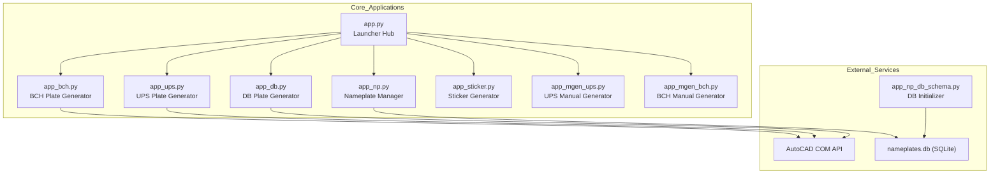
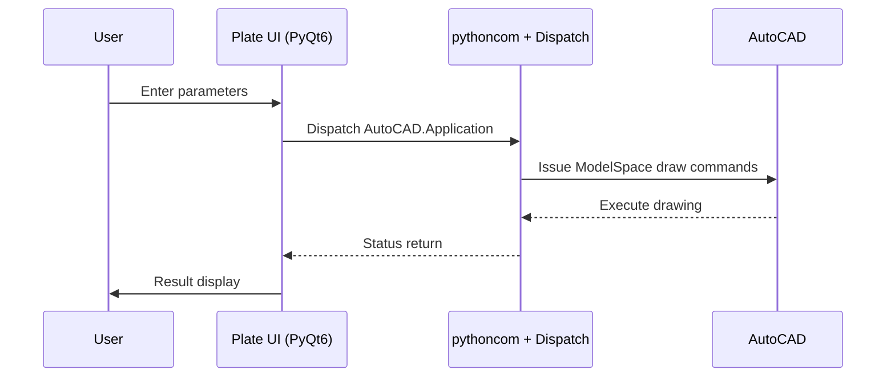
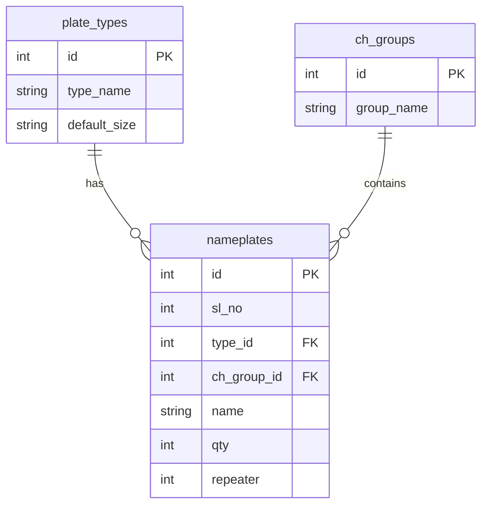

# Plategen : Industrial Plate Generation Suite

Plategen is a **modular desktop application** designed for automated generation of technical rating plates and nameplates for heavy industrial electrical equipment, including UPS systems, BCH/DC DB panels, and industrial nameplates.

The tool directly interfaces with **AutoCAD using COM automation**, reducing human drafting effort and ensuring fabrication-ready drawings.

Built for teams at **Liveline Electronics**, developed by **Bitmutex Technologies**.

[](https://github.com/aamitn/plategen/releases/latest/download/PlateGenSetup.exe)
[](LICENSE)

---

## ⭐ Features Overview

| Feature                       | Description                                                                                                  | Core Technology                         |
| ----------------------------- | ------------------------------------------------------------------------------------------------------------ | --------------------------------------- |
| Multi-Executable Architecture | Independent EXEs for UPS, BCH, DB plates, Nameplate configuration, Stickers, and Technical Manual Generator. | PyInstaller, PyQt6                      |
| AutoCAD Drawing Automation    | Fully automated drawing of plates using AutoCAD’s COM interface.                                             | `win32com.client`, AutoCAD Object Model |
| Structured Data Capture       | Electrical inputs, dimension logic, cable sizing, I/O signal mapping.                                        | PyQt6                                   |
| BOM, Excel & PDF Generation   | Exports structured reports for manufacturing processes.                                                      | `openpyxl`, `reportlab`, `docxtpl`      |
| SQLite Nameplate Manager      | Database-driven nameplate grouped production.                                                                | SQLite                                  |
| Application Hub               | Central launcher, process watchdog, failure recovery.                                                        | PyQt6, `psutil`                         |

---

## 🧩 List of Applications

The suite ships with the following executables:

| Executable            | Purpose                                       |
| --------------------- | --------------------------------------------- |
| `app.py`              | Central launcher & UI hub                     |
| `app_ups.py`          | UPS Rating Plate Generator                    |
| `app_bch.py`          | BCH / DCDB Plate Generator                    |
| `app_db.py`           | Distribution DB Plate Writer                  |
| `app_np.py`           | Nameplate database & bulk generator           |
| `app_np_db_schema.py` | Database initializer                          |
| `app_sticker.py`      | Sticker/Label generator                       |
| `app_mgen_ups.py`     | UPS Technical Manual Generator (DOCX output)  |
| `app_mgen_bch.py`     | BCH Technical Manual Tool (Under development) |

---

## 🖥 System Requirements

* **Windows 10 / 11** *(AutoCAD COM requires Windows)*
* **AutoCAD installed** (any version with COM interface)
* **Python 3.8+** (for development builds)

Install dependencies:

```bash
pip install -r requirements.txt
```

Launch main hub:

```bash
python app.py
```

---

## 🧱 Architecture Overview

Plategen follows a **Micro-App Architecture**, where each EXE is responsible for one function, while the launcher manages execution, state, and AutoCAD interactions.

### System Overview



---

## ⚙ Data Flow – AutoCAD Plate Generation



---

## 📦 Nameplate Database Model



---

## 🧰 Development Snippets

### AutoCAD Automation

```python
import pythoncom, win32com.client

pythoncom.CoInitialize()
acad = win32com.client.Dispatch("AutoCAD.Application")
doc = acad.ActiveDocument
doc.ModelSpace.AddLine((0,0,0), (100,0,0))
pythoncom.CoUninitialize()
```

### Generating DOCX (from `app_mgen_ups.py`)

```python
from docxtpl import DocxTemplate

doc = DocxTemplate("template-mgen-ups.docx")
doc.render(context)
doc.save(output_file)
```

---

## 🚧 Applications Under Development

* `app_mgen_bch.py`
  Shows a Qt dialog:

```
⚠ This module is under construction.
```

---

## 📜 License

MIT License © Bitmutex Technologies / Liveline Electronics
