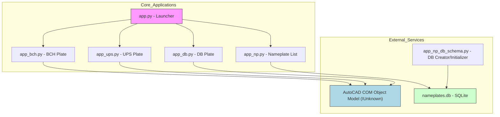
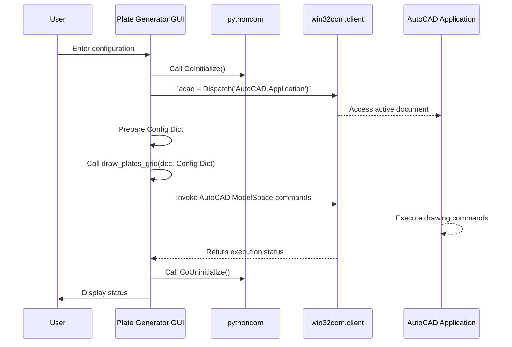
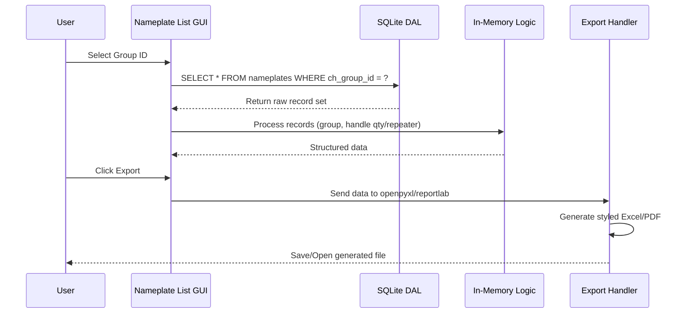
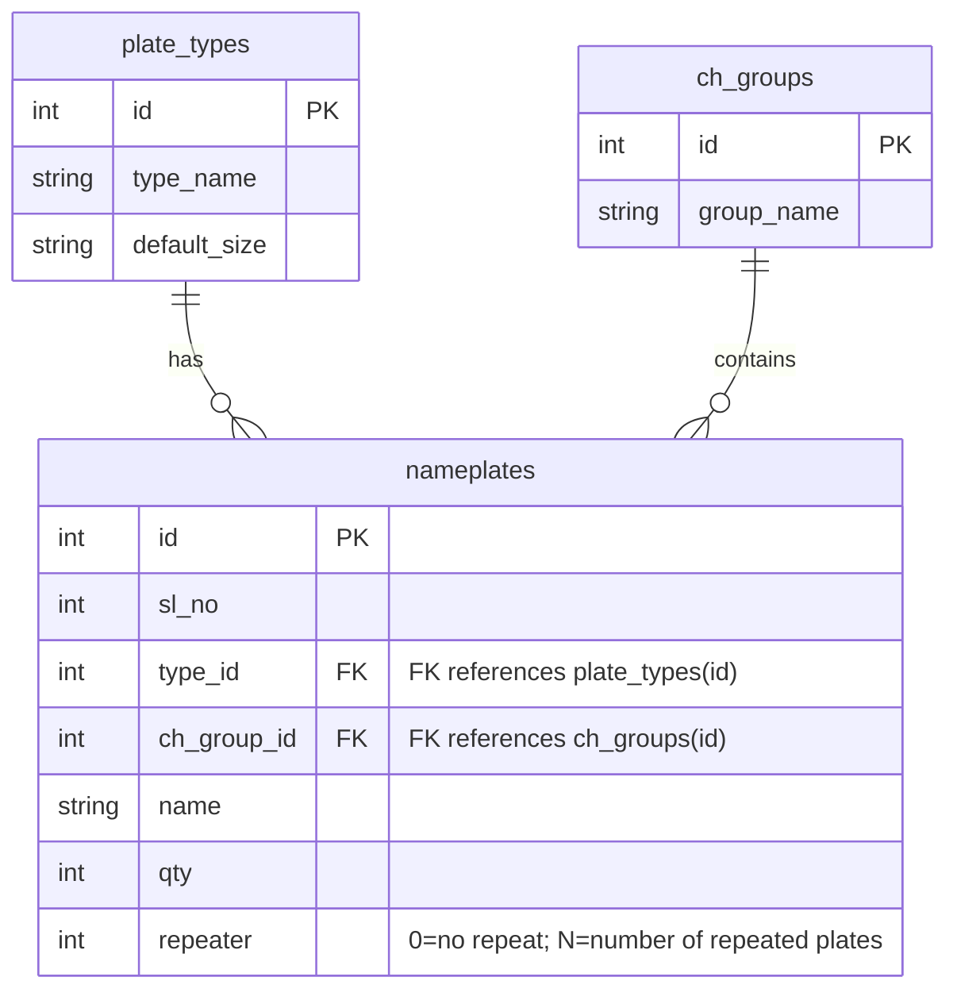

# Plategen : Industrial Plate Generation Suite

Plategen is a **modular desktop application** designed for automated generation of technical rating plates and nameplates for heavy industrial electrical equipment, including UPS, BCH, AC/DC DB panels. It provides **direct integration with AutoCAD via COM automation**, ensuring high precision and eliminating manual drafting errors in critical manufacturing documentation.


Built for teams at **Liveline Electronics**.

[](https://github.com/aamitn/plategen/releases/latest/download/PlateGenSetup.exe)
[](LICENSE)

---

## Features Overview

| Feature                            | Description                                                                                                              | Key Technology                          |
| ---------------------------------- | ------------------------------------------------------------------------------------------------------------------------ | --------------------------------------- |
| Modular Multi-App Architecture     | Separate executables for UPS, BCH, DB plates, Nameplate management, Stickers, and Technical Manual generation.           | PyInstaller, PyQt6                      |
| AutoCAD COM Automation             | Direct control of AutoCAD’s Object Model for fully automated industrial plate drawings.                                  | `win32com.client` (Python COM), AutoCAD |
| Structured Data Entry & Validation | Guided electrical and mechanical input forms with domain-level validation (PF, kVA/kW, circuit load, feeder parameters). | PyQt6, internal rules engine            |
| Export & Documentation             | Generate Excel, DOCX, and PDF outputs for shop-floor execution, handover formats, and QC workflows.                      | `openpyxl`, `reportlab`, `docxtpl`      |
| Nameplate Database Layer           | SQLite-backed storage enabling reusable plate definitions, reusable data groups, and repeat handling.                    | SQLite + DAO layer                      |
| Launcher Hub                       | Central controller for spawning sub-apps, detecting AutoCAD runtime, and maintaining clean lifecycle.                    | PyQt6, `psutil`, `subprocess`           |
| Sticker & Label Generator          | Create production-ready equipment stickers, tags, and safety labels with template-based sizing.                          | PyQt6 + drawing output                  |
| Technical Manual Generators        | Automatically compile DOCX-based technical handbooks for UPS and BCH using collected configuration and templates.        | `docxtpl`, templated reporting          |

---

##  Getting Started

### System Prerequisites
- **OS:** Windows 10/11 (Required for AutoCAD COM Interoperability)  
- **Python:** 3.8+  
- **CAD Software:** AutoCAD installation (Required for plate drawing)  

### Dependencies
Managed via `requirements.txt`:
- `PyQt6`
- `pywin32` (COM integration)
- `openpyxl`
- `reportlab`
- `psutil` (AutoCAD process management)

### Installation & Execution
```bash
# Clone the repository
git clone https://github.com/your-repo/plategen.git
cd plategen

# Install dependencies
pip install -r requirements.txt

# Run the Launcher
python app.py
```

---

##  Application Architecture

Plategen follows a **Micro-Application Architecture** with a central launcher orchestrating multiple specialized generator modules.

### System Architecture & External Interfaces


### Module Responsibilities

| Module                | Responsibility                       | Technical Implementation                                                                           |
| --------------------- | ------------------------------------ | -------------------------------------------------------------------------------------------------- |
| `app.py`              | Lifecycle & State Management         | QApplication init, AutoCAD process checks (`psutil`), launches sub-apps via `subprocess`.          |
| `app_bch.py`          | BCH Rating Plate Generation          | Converts typed GUI inputs into config dict and draws block geometry in AutoCAD via COM.            |
| `app_ups.py`          | UPS Rating Plate Generation          | Performs electrical calculations (kW = kVA × PF), grid tiling, and AutoCAD model placement logic.  |
| `app_db.py`           | DB Rating Plate Generation           | Manages structured drawing for DB feeders, breaker layout, cable data, and coordinate positioning. |
| `app_np.py`           | Nameplate List I/O                   | SQLite DAL, grouping logic, repeats handling, Excel/PDF export via `openpyxl` / `reportlab`.       |
| `app_np_db_schema.py` | Database Schema Initialization       | Creates SQLite schema with `plate_types`, `ch_groups`, `nameplates` tables and seeds defaults.     |
| `app_sticker.py`      | Industrial Sticker & Label Generator | PyQt6 GUI for dimension-driven sticker generation and AutoCAD/print-ready output.                  |
| `app_mgen_ups.py`     | UPS Technical Manual Generator       | Produces DOCX technical manuals (`docxtpl`), processing plate spec + operational data.             |
| `app_mgen_bch.py`     | BCH Manual Design Tool (WIP)         | Currently displays an “Under Construction” Qt dialog; manual structuring and export planned.       |


##  Key Workflows

### 1. Rating Plate Drawing: COM Automation


### 2. Nameplate List Generation & Export


### 3. Nameplate Database Schema


---

## ️ Development Notes

### AutoCAD COM Interface
```python
import pythoncom
import win32com.client

try:
    pythoncom.CoInitialize()
    acad = win32com.client.Dispatch('AutoCAD.Application')
    doc = acad.ActiveDocument
    # Drawing logic
except Exception as e:
    pass
finally:
    pythoncom.CoUninitialize()
```

### Drawing Primitives
- **Lines:** `doc.ModelSpace.AddLine(StartPoint, EndPoint)`
- **Text:** `doc.ModelSpace.AddMText(InsertionPoint, Width, TextString)`  
Text must use predefined AutoCAD styles (`STYLE_REG`, `STYLE_BOLD`) in the drawing template.

### Database Logic (`app_np.py`)
- Ensures `nameplates.db` exists and is structured on startup.
- Handles repeater logic: `0` = one-off plate, `>0` = multiple sequential plates.

---

##  License

MIT License © [Bitmutex Technologies / Liveline Eletronics]

