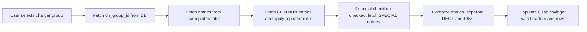

# Nameplate List Excel/PDF Generator

A PyQt6-based desktop application to generate, manage, and export nameplate lists for industrial panels. Supports **rectangular** and **ring type** nameplates, bulk quantity updates, and exports to **Excel** and **PDF**.

---

## Table of Contents

* [Features](#features)
* [Database](#database)
* [Application Architecture](#application-architecture)
* [UI Overview](#ui-overview)
* [Functionality Details](#functionality-details)
* [Export Logic](#export-logic)
* [Running the App](#running-the-app)

---

## Features

* Fetches nameplate entries from **SQLite database** (`nameplates.db`).
* Supports **rectangular** (`RECT`) and **ring** (`RING`) nameplate sections.
* Dynamic addition of new entries at the **bottom of each section**.
* Bulk update of quantities for all entries.
* Export nameplates to:

  * **Excel** (`.xlsx`) with section-specific colors, column headers, and word wrapping.
  * **PDF** (`.pdf`) with similar formatting.
* Include **special nameplates** via checkbox.
* Remove selected entries while preserving section headers.

---

## Database

The app relies on a SQLite database: `nameplates.db`.

### Database Tables

1. **ch_groups**

   | Column     | Type                | Description               |
   | ---------- | ------------------- | ------------------------- |
   | id         | INTEGER PRIMARY KEY | Unique group ID           |
   | group_name | TEXT                | Name of the charger group |

2. **plate_types**

   | Column       | Type                | Description               |
   | ------------ | ------------------- | ------------------------- |
   | id           | INTEGER PRIMARY KEY | Unique type ID            |
   | default_size | TEXT                | Default cutout/size value |

3. **nameplates**

   | Column      | Type                | Description                      |
   | ----------- | ------------------- | -------------------------------- |
   | id          | INTEGER PRIMARY KEY | Unique nameplate ID              |
   | name        | TEXT                | Nameplate label                  |
   | ch_group_id | INTEGER             | References `ch_groups.id`        |
   | type_id     | INTEGER             | References `plate_types.id`      |
   | qty         | INTEGER             | Default quantity                 |
   | repeater    | INTEGER             | Repeater logic (0,1,2)           |
   | sl_no       | INTEGER             | Serial number within the section |

---

## Application Architecture

### Core Modules

1. **Database Handling**

   * Auto-downloads DB if missing (`DB_URL`).
   * Can execute schema Python/EXE if download fails.
   * Queries:

     * Fetch charger groups (excluding `COMMON`/`SPECIAL`).
     * Fetch nameplates by group ID, including filtered `COMMON` and `SPECIAL` entries.
   * Handles repeater logic for specific groups (`SFCB`, `DFCB`, `FFCB`).

2. **PyQt6 GUI**

   * Main window (`QWidget`) with vertical layout.
   * Input fields: Customer name, Job number, Charger group (`QComboBox`).
   * Buttons: Generate, Export to Excel/PDF, Add/Remove entries, Bulk update.
   * Table (`QTableWidget`) to display entries with **SL No, Nameplate Name, Cutout/Size, Qty**.
   * Section headers (`--- RECTANGULAR TYPE ---` / `--- RING TYPE ---`) are bold and light gray.

3. **Logic Handling**

   * `add_custom_entry(type_section)`: Adds new entry at **bottom of section**, auto-assigns SL No.
   * `remove_selected_entry()`: Deletes selected rows, preserves section headers.
   * `bulk_update_qty()`: Sets quantity for all non-header rows.
   * `clear_all_entries()`: Clears all entries while preserving headers.

---

## UI Overview

```
+-----------------------------------------------------+
| Customer Name: [_________]  Job Number: [____]     |
| Charger Group: [ComboBox]  [Include Special] [ ]  |
+-----------------------------------------------------+
| Buttons: Generate | Export Excel | Export PDF      |
+-----------------------------------------------------+
| Bulk Qty: [SpinBox]  [Update All]                  |
| Clear All Entries                                  |
+-----------------------------------------------------+
| Table:                                             |
| SL No | Nameplate Name | Cutout/Size | Qty         |
| --- RECTANGULAR TYPE ---                            |
| 1     | ABC          | 100x50       | 1           |
| 2     | DEF          | 150x60       | 1           |
| --- RING TYPE ---                                   |
| 1     | GHI          | Φ80           | 1           |
+-----------------------------------------------------+
| Buttons: Add Rect | Add Ring | Remove Selected     |
+-----------------------------------------------------+
```

---

## Functionality Details

### Nameplate Fetching

* Entries are fetched from DB based on selected charger group.
* Includes `COMMON` entries with repeater rules:

  * `SFCB`: skip repeater 2 entries.
  * `DFCB`: add suffix `(Charger 1)`, `(Charger 2)` if repeater=2.
  * `FFCB`: add suffix `(FC)`, `(FCB)` if repeater=2.
* Optional inclusion of `SPECIAL` group via checkbox.

### Section Management

* Rectangular and Ring types have **separate sections**.
* Section header is inserted if section doesn’t exist.
* New entries are added **after the last row of that section**.
* SL No is auto-calculated per section.

### Table Row Management

* **Adding Entries**

  * `add_custom_entry("RECT")` → adds empty row at bottom of RECT section.
  * `add_custom_entry("RING")` → adds empty row at bottom of RING section.
* **Removing Entries**

  * Selected rows are deleted.
  * Section headers are preserved.
* **Bulk Quantity Update**

  * All rows in the table (excluding headers) have Qty updated.
* **Clear All**

  * Removes only non-header rows.

---

## Export Logic

### Excel Export

* Uses `openpyxl`.
* Section headers highlighted:

  * RECT: light blue, bold.
  * RING: light orange, bold.
* Column headers inserted for each section.
* Text wrapping for **Nameplate Name** if >30 chars.
* Borders applied to all cells.
* Auto-open file after save.

### PDF Export

* Uses `reportlab`.
* Section headers bold and grey.
* Column headers included for each section.
* Nameplate Name wrapped using `Paragraph` style.
* Table grid applied, centered alignment.

---

## Database Interaction Flow



---

## Running the App

1. Ensure Python 3.11+ is installed.
2. Install dependencies:

```bash
pip install PyQt6 openpyxl reportlab
```

3. Run the app:

```bash
python nameplate_app.py
```

4. The app will automatically download `nameplates.db` if not present or create it via schema.

---

### Notes

* Section-specific SL No are auto-calculated and incremented.
* New entries are always appended **after the last entry of the section**, preserving order.
* DB schema scripts (`app_np_db_schema.py` or `.exe`) must be present for fallback creation.
* Supports multi-platform: Windows, macOS, Linux.
